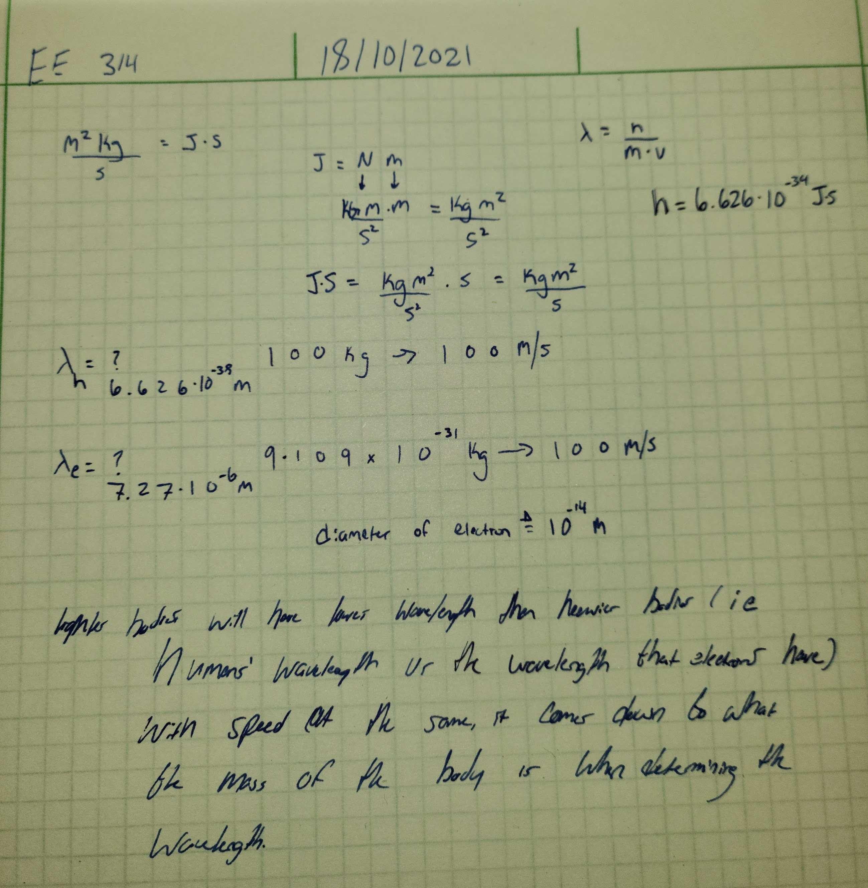

# Game 14
## Haadi Majeed
### 18/10/2021

## Electrons
It is hard to determine the exact location of electrons due to how small they are. Unlike larger body particles, when you measure attributes of them, it does not tend to interfere with them. However, due to how small electrons are, when you attempt to measure them you interefere with it as the radiation messes with it.

What I get out of it, is that we know they are moving ***extremely*** quickly and we cannot measure it doing so due to it's speed and inability to do so without interfereing with it.

##  Einstein
The actual title of Einsteins paper on Special Theory of Relativity is

> On The Electrodynamics of Moving Bodies

He is working with Maxwell's electrodynamics and Newton's laws to establish that the laws of phsyics are constant on non-accelerating particles.

He is pulling together different loose ends from other scientists like Maxwell and Newton to draw conclusions on how components work to explain how frequency and wavelength apply to electrons when moving in space-time.

## De Broglie's Equation
