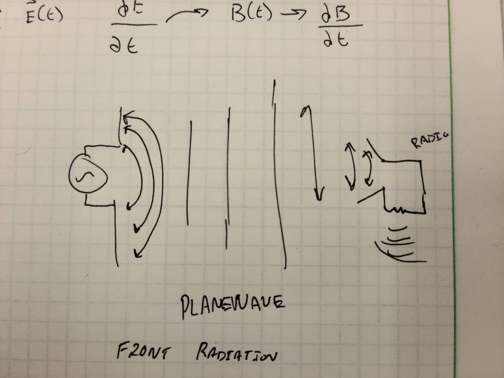

# Game 15
## Haadi Majeed
### 20/10/2021

## In your words and drawing, how does an antenna work?  
Antennas that are recieveing a sinosodial wave input being output along two conductors (often wirelike) that are oriented in varying angles, with most being 180 degrees or lesser. The waves emit at various frequencies beyond the circuit/source itself creating waves that propogate outward. From there the recieving end gets an induced voltage on a similar set of conductors and it is able to interpret what to do with it based on the frequency and act accordingly. 

I (attempted) to create a small diagram, this is based on if both source and reciever are set to the same frequency, it will pick up on it

---

## What are your ideas about what are you going to work on for your final paper?  
Some topics that I am interested in:
- Electromagnetic Train / Maglev Trains
- Communications with far distance objects (various satallies, rovers, etc)
- Construction of Quantum Computers