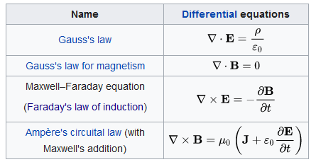
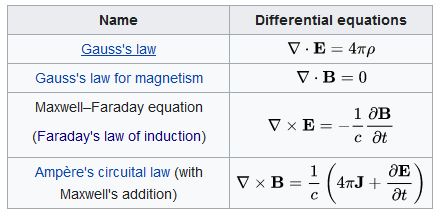
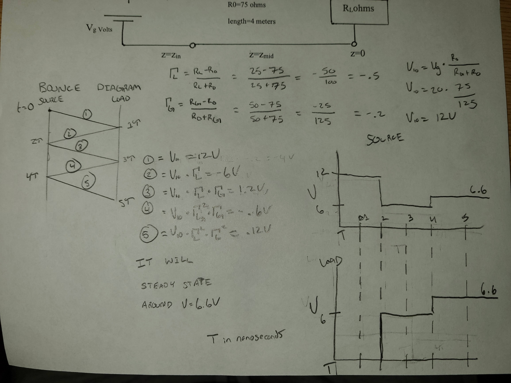

# EE 314 HW 2
## Haadi Majeed
### 18/10/2021

## Read the following articles

[Scientific American](http://www.scientificamerican.com/article/what-happens-when-lightni/)  
- Summary:
  - From 2001, the last time a plane has crashed due to being struck by lightning was in 1967 due to it igniting and causing the fuel tank to explode. Since then developments and tests have been made to made planes more safe. When being struck by a lightning, it most commonly will strike an end point of the plane, such as the tail, nose, or wing tips, and exit through another. It will create a loud noise and a bright flash of light, however the most pilots will report is occasional light flickering and temporary interference with instruments. Due to the body of the plane bring primarily aluminium, the electricity from the lightning can move though with ease, and the engineers who construct the plane must ensure that the electricity can go through the width with no interruptions and stay on the outside of the plane, without letting it jump to the interior. The lightning moving through the body of the plane also has a chance to induce a current to the electronic systems within, thus EM shielding has to be applied to prevent this. Then there is the fuel area, this area is now engineered to have more protection to ensure that it cannot be ignited, even including a new variant of fuel that has less explosive vapours that are emitted. Modern planes also have a system similar to a lightning rod on buildings.  

[Washington Post](http://www.washingtonpost.com/blogs/capital-weather-gang/wp/2014/08/27/why-is-an-airplane-safe-from-lighting-strikes/)  
- Summary:
  -  This article, written 13 years after the first, also confirms that the last time a plane crashed explicitly due to lightning was in 1967. It talks about how being in a plane when lightning strikes it (from a passenger's point of view) is similar to being in a car when lightning strikes it. The article extends to how lightning can hit a plane and then either bounce back to the clouds, or continue to the ground. However, when lightning does hit a plane, it can discharge up to 200 thousand amps through the frame, in which it has *amp*ple opportunity to induce a current. An example is listed of such occurring, when an in-flight employee was using a headset when lightning struck, killing them.  It also states that statistically, lightning hits a plane at least once a year.

[ScienceABC](https://www.scienceabc.com/eyeopeners/what-would-happen-if-your-airplane-is-struck-by-lightning-in-flight.html) 
- Summary:
  -  This article from 2017 clarifies that lightning often leaves through the tail of the plane but does enter through the nose or wing tips. It also reconfirms the previous statistic of how frequently it occurs. Airplanes are fairly safe due to all the precautions that have been built into them over the last few decades, and as the article states, it effectively makes the plane a faraday cage when in the air. 

### Overall
Lightning is not incredible threat to planes these days, however there still are risks such as being directly connected to the plane via electrical cable, I think in general though, there is no need to fear being in a plane in regards to lightning. As for what they have to do with Maxwell, it shows induction and how with enough amps its very easily dangerous even if the initial service is very safe because if the induced current is stronger than the initial/expected, it can be a risk. Finally, the components that need to be protected are those regarding the controls of the plane, such as wing steering, wheel hydraulics, communications, and radar. These are scattered around the plane and not just in the cockpit, thus meaning wiring is throughout the whole plane. In order to protect these from inducted currents though, they are often in very thick insulators and coated in materials to prevent outside influence from occurring to them.

---

## Critical Examination of popular literature
- Go to Wikipedia and look under Maxwell’s equation. You will find a huge amount of interesting material. Your task for this problem is provide a summary of the history, the form of the equations in SI and cgs and other forms that you may find interesting, and the contributions of Heaviside to these equations. 
- Please take notes on what you find interesting and investigate the forms of the equation that you see. You may find it interesting to follow and do more research based on that, please provide good set of references for this problem. 
- Finally, examine some of the references and see how useful they are to you. For this part, you need to explain what reference you examined and what you learned.  

I think Wikipedia is a good place to get started on learning the basics of a topic, however should not be the only place you go to learn a topic. It presents surface level knowledge on every topic, but usually won't give more than that. Regardless, what Wikipedia has to report under [Maxwell's equations](https://en.wikipedia.org/wiki/Maxwell%27s_equations):  

### Equations in SI
  
[Source](https://en.wikipedia.org/wiki/Maxwell%27s_equations)  

### Equations in GCs
  
[Source](https://en.wikipedia.org/wiki/Maxwell%27s_equations)

The integral forms are interesting and based on the variables, I have some ideas what they is occuring, but I do not fully understand what all is going on, I don't know the story that the equation is trying to tell. 

As for other references, I read a lot on the other pages of Wikipedia that linked outward from the original one trying to gain a better understanding of the topic, one that really caught my attention was talking about [Current Density](https://en.wikipedia.org/wiki/Current_density), upon reading the article, I went out to try to figure out some more information about it, so I hit both [Maxwells-equations.com](https://maxwells-equations.com/density/current.php) and [Physics.info](https://physics.info/electric-current/summary.shtml) to try to learn more. It makes sense that it is a vector, as direction and magnitude are quite important to the subject, it leaves me with some questions though, such as what materials are most effective to have high density, when do you want low vs high density and how their usecase varies? What would a thick wire that outputs the same amount at low density offer that a thin wire with high density at equal output cannot offer, and vice vera? 

---

## Read and provide a summary of Chapter 4 of the book that we have been reading.  The summary should include what are the main points and what you learned from the chapter
This chapter covers Faraday's Law and a concept of Back EMF which is what occurs when the electric field that is generated is opposed to the change, sometimes dubbed as "back emf". This is derived via Lenz's Laws, and this process is the explanation on how energy conservation persists with magnetic fields. Faraday's Law comes and explains how the change in magnetic field over time, a solenoid with a given number of turns, and a cross sectional area is the induced voltage in the circuit.  
The next portion explains how inductors can become charged and act as a voltage source, but in reality, it tends to build up charge and then release it over time instead of all at once like a wire would. It next explains how capacitors can store energy even after being removed from the circuit that they obtained the charge from but goes on to state that a super capacitor would be needed in order to negate a standard wire's resistance from causing the capacitor from just discharging immediately afterwards.  
Next, the chapter covers what impedance is, and it explains the ratio of voltage to current in a circuit. The implied energy storage of imaginary impedances is called reactance since it is just a reaction to the voltage source. It can be equated as `V = I * Z` with `Z` representing impedance. Note that `V` and `I` are the root-mean-square of voltage and current in phasor notation. Impedance is calculated as the following: `Z = j * 2π * f * L`. `2π` because the current wave is 90 degrees behind the voltage, `f` is wave frequency, `j` is `√(-1)` (imaginary number), and `L` is inductance. Capacitors' impedance is calculated as such `Z = (-j) / (2π * f * C)` where `j` and `f` are the same from before, but `C` indicating capacitance.  
Door bells are very primitive holy crap. Send very big voltage at ~20Hz and make it go brrrrrr and ring. Apparently, this is how old phone lines used to know when to ring too.  
Ferrite is a ceramic material in contrast to other ferromagnetic materials which are almost all metals. Iron bad. There are things called Eddy Currents which are unwanted, induced currents that occur within a conductor via a changing magnetic field. These currents have free-moving electrons and cause high amounts of loss within transformers and inductors and ramp up with frequency. By putting the iron cores in insulated materials (when working with low frequency, high voltage), you can resolve this issue. OR just use a Ferrite core instead as it will not have issues with eddy currents even at higher frequencies. Ferrite will still become less effective when going from MHz to 100MHz and lose much power to heat. Ferrite is also incredibly useful for microwave, gyros (the eating ones unfortunately those are low in iron), isolators, and circulators.  
Perpetual motion is kinda wack, basically from faraday we can see that a field moves away in a wave formation from the source, it will propagate forever until its absorbed. And Light, Radio, and X rays all do this and it bizarre.   

---

## Diagram

