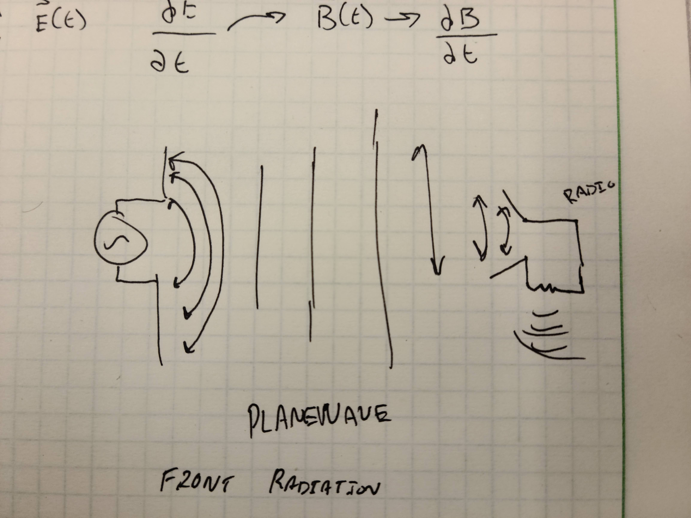

# Haadi Majeed
## EE 314 Course Reflection and Portfolio

---

# Game 7 
## [Article on Maxwell](https://mathshistory.st-andrews.ac.uk/Biographies/Maxwell/)

To begin with, I was very impressed that at the young age of 14 he was fully able to understand ellipses and go into the theoredics of it, meanwhile the earliest introduction to base geometry with equations for such that I encountered was in 8th or 9th grade, and that was just a surface level of understanding, I was not going to be creating any new or revolutionary breakthroughs with my understandings. He would be described as somebody who was aloof during his junior high years, and understandable so as his classmates were left in the dust when comparing his understanding to the material in comparison to theirs, and this was only previewd by them later in highschool when he was winning awards and scholarships left and right. This, along with the fact that he had 3 papers that were breaking grounds by the age of 16, blows my mind, thinking at what I have done so far seems so insignifigant in comparison. 

He had many other contributions to the world of science as he progressed in his life, with the article emphasizing on his extensions on Faraday's theories over electricity and magetisim. He was able to link concepts together with such a level of expertise and understanding that it was almost scary and even got Stokes to write to him, acknowledging that he had advanced his theorems. He would later research Saturn and its rings with the topic being set in 1847 for the Adams Prize of 1857. With researcher showing incredible results, within 10 years he furthered the understanding of the planet and it's rings immensely. His main arguement was to show that stability in the rings could only occur if the rings were thousands of small particles and not one solid uniform ring, something that would later be proven by the Voyager telescope. The fact that he discovered this and had a solid theory and evidence to back it up without the technologies we have today to figure it out is incredible and once again shows just how well he understood the subject at hand and how to go about it. INCREDIBLE!

I think that the most incredible part of what he has done was working with the speed of light. In 1862 just 5 years after completeing work on Saturn's rings, did he calculate the speed of waves in an electromagnetic field and corrolate it to the speed of light. This single part is critical for engineers today as it applies to how light waves work fundamentally and would further all understanding of the electromagnetic. However to a bit more directly answer what would be the most important, "Maxwells Equations" would be, however that feels kinda cheat-y to say as that is a core concept of E&M. 

I think Maxwell as a person is incredibly interesting, he was able to master and understand such complex topics that had many of the brightest minds of the time working on, but would come out on top with understanding and though-ness. He had such an indepth understanding of Space, E&M, Theoredical and Practical Maths, and even Chemistry with the Kinetic Theory of Gas. If I could understand just one of these to the level he did, I would feel acomplished, but he did way more than just these few things, winning awards, gaining prestidge, and even appointed hihgh level chairs at Colleges and Universities. I think Maxwell was truly someone who advanced humanity's understanding of the world signifigantly, and I can only imagine how much further he could go with today's technology in hand.

---

# Game 9/27/21 Einstein's Papers
## The Annus Mirabilis Papers
Einstein wrote 25 papers in 1905. 4 of these were grouped together and labeled as the Annus Mirabilis Papers and were revolutionary to modern day physics and helped people create a very foundational basis of space, time, mass, and energy. 

### On a Heuristic Viewpoint Concerning the Production and Transformation of Light
#### Photoelectric Effect
Published on June 9th in 1905, this paper's content covered a lot about the photoelectric effect and how it applied to black bodies (something that can absorb all colours of light). He used Maxwell's Equations along with Planck's derivation of black-body radiation to explain the energy propagation of light rays as it moves across space. The concepts that he briefs upon contradicts some of what Maxwell established for Electromagnetic behaviour. 

### On the Motion of Small Particles Suspended in a Stationary Liquid, as Required by the Molecular Kinetic Theory of Heat
#### Brownian Motion
Published on July 18th in 1905, this paper is based on the kinetic theory of gases and would provide evidence of the atom. This critical paper would be the new foundation chemists and physicists alike as it changed the whole way people understood things at the low atomic level for the respective subjects.

### On the Electrodynamics of Moving Bodies
#### Special Relativity
Publised on September 26th of 1905, this paper covers his well known special theory on relativity and the speed of light. This paper only refers to 5 other scientists and those would be Isaac Newton, Maxwell, Henirch Hertz, Christian Dopplar, and Hendrik Lorentz. Besides that this is complete and original work with his own research and findings. This would become the foundation for years to come.

### Does the Inertia of a Body Depend Upon Its Energy Content?
#### Mass–Energy Equivalence
Published on the 21st of November in 1905, this paper would establish the world famous eqation of `E=mc^2` and shows how energy of a body at rest relates to mass and the speed of light. 

### On The Movement of Small Particles Suspended in Stationary Liquids Required By The Molecular-Kinetic Theory of Heat
#### Statistical Mechanics and Brownian Motion
Published March 17th in 1905, this paper covers how diffusion at a macrosopic scale matches what can be seen as "random" at a microscopic scale and how a force is exherted on each individual particle, he shows how an object suspended can simulate an atom in equalibrium with many smaller components colliding randomly and causing entropy. 

## Overall
I was blown away by how many reviews he had written for other people's works in 1905 alone, and that's ignoring all the others he has done in years before and after. The sheer amount of knowledge he had for the subjects he studied truly was shown in these reviews and papers. I attempted reading a few of them on Harvard's website linked below, but the content was so beyond my head I was simply lost. 

## Sources
- https://en.wikipedia.org/wiki/List_of_scientific_publications_by_Albert_Einstein
- https://en.wikipedia.org/wiki/Annus_Mirabilis_papers
- http://soft-matter.seas.harvard.edu/index.php/On_The_Movement_of_Small_Particles_Suspended_in_Stationary_Liquids_Required_By_The_Molecular-Kinetic_Theory_of_Heat
- https://einsteinpapers.press.princeton.edu/

---

# Game 11

### What do you think about Inquiry Based Learning that we have discussed today? Have you seen it in other places?  Do you see the value?  Please reflect

I think that the inquiry based learning is something that is more logical than what often occurs in academic where we recieve lecture and then guidelines with a set standard to achieve, going outside and beyond it is usually not as well covered and getting clarity and better understanding fully falls on the student to go to the professor(s) to get it figured out. Even then some professors will tell you not to fully worry about it and just focus on the assignment. Other professors will get enthusiastic and try to give understanding for the subject, however it will usually be the end of it. 

This upcomming semester, it feels like there are a few classes that are trying to be a little more inquiry based with some open interpretation questions and encouraging student questions to progress the course, however it feels like it is still coming short of the overall idea of inquiry based learning. 

### What is the issue of duality of wave and particle?  Are Electons, showing waves or particle characteristics?  Explain 

A property of particles is that is can only be in one position at any point in time, this costrasts a property that waves have which is that a single wave can be in multiple positions at any given point in time. As shown in the video, the electron before being observed at the entire time was showing properties of being a wave, with it emitting on the paper with high and low areas on the paper. But at the same time, when they were closely observing the electron, watching it particle at one position and then it was acting as though it was a particle creating just 2 pillars of light instead of the wave chart instead. 

---

# Game 12

## Describe what was the challenge and the Physics had in the first decade of 20th century regarding the "Black Body Radiation"

Black body radiation is when an object in a dark room appears grey in colour due to the energy being emitted being on the infrared spectrum, and therefore cannot be percieved by human eyes. It is something that seems bizzare since the item would achive thermal equilibrium, the black body would radiate all of its energy instantly until it was finished. This action would be coined as "ultraviolet catastrophy". 

## What was the challenge, describe it clearly, and how was it solved, by whom and what was the idea that the solution was based on.

Max Planck was the person who came with an answer to the ultraviolet catasatrophy, he comes to the conclusion that energy distribution is not continious. He was able to get an equation related with what was occuring to help create greater understanding for what was occuring. He was able to come to such a conclusion by analysing the waves of electrons coming from the black body's radiation.

Einstein was using the attribute of light being quantiumtised, and as he shot different coloured lights at a plate, there would be a difference as he would continue with the experiment, with blue light allowing an electron to get freed, however red, no matter how many times he tried, would not free an electron. 

## Please write more, and put your thoughts in it.

Being able to measure objects' temperatues from a distance is incredibly cool, the name comes because they absorb almost all light cast upon them, and would radiate it with near perfection. Objects that are extremely hot tend to have more blue colouration while a cooler object has more red colouration. The wavelength changes as the temperature increases within an object.

If I understand this correctly, it will absorb all of the light it can while dumping all of it as it radiates it away in the invisible light spectrum. Is the energy level that much higher that it does not emit any colour of visible light? Does it do anything special if it is in a truly lightless room?

---

# Game 13

### 11/10/2021

## What did Einstein discover in his work on Photo-electric effect?
Einstein was shooting various colours of light at varying intensities, but no matter what the intensity was, it would only be dependent on the colour (wavelength / frequency) to determine if an electron would be released from the plate or not. With this, he was able to come to the conclusion that they were in bundles.

## What did de Broglie find, state the equation, and discuss what you understand from it and his findings
Because Partical-Wave Duality exists, other things could also be waves besides light. The circumfrence of the electron orbit must be X* wavelength. He also found out the electrons were in waves around the nucleus instead of actually moving around. His equation is the following:  
`λ = h/(m*v) = h/p`  
He was able to use this to show hydrogen's light specturm and how it absorbs and emits certain frequencies from electron emission from n >= 2.  

## What did you learn about the structure of atoms from today's content?
Electron simply did not have energy, the energy is only radiated when the electron changes which orbit it is in. It could be used to predict what colour would be displayed. As long as the electron is in the same orbit, it would not radiate any energy. I did not know that sub-atomic particles could just "instantly teleport" from one point in space to another  

## What are your challenges with modern physics, what are YOU struggling with?
I do not quite understand how schrodinger was/is able to apply the quantum mechanics of every atom, but I think for that it is due to me not fully understanding how it works. Something else I do not quite understand is how every state is possible to exist at the same time with quantum, that is just something I don't grasp yet, and I think that is because I am so used to everything being binary, 0 or 1.

## Other notes
Partical-Wave Duality  
Sub-atomic particles are allowed to dissapear and reappear within a given space. particles around a nucleus are allowed to move around as well, and that is what determines the "outer bounds" of the nucleus.  
Peaks of the wave is where particles ***Usually*** show up at, and at the mid-point is an area that particles avoid  
"can I describe the world in tiny particles and explain everything with that"  
If measuring the presence of electrons itself causes them to get disturbed, I think that is why when they tried to measure the particles as they were going through the slits is why it went back to acting as a particle vs as a wave.

---

# Game 14

### 18/10/2021

## Electrons
It is hard to determine the exact location of electrons due to how small they are. Unlike larger body particles, when you measure attributes of them, it does not tend to interfere with them. However, due to how small electrons are, when you attempt to measure them you interefere with it as the radiation messes with it.

What I get out of it, is that we know they are moving ***extremely*** quickly and we cannot measure it doing so due to it's speed and inability to do so without interfereing with it.

##  Einstein
The actual title of Einsteins paper on Special Theory of Relativity is

> On The Electrodynamics of Moving Bodies

He is working with Maxwell's electrodynamics and Newton's laws to establish that the laws of phsyics are constant on non-accelerating particles.

He is pulling together different loose ends from other scientists like Maxwell and Newton to draw conclusions on how components work to explain how frequency and wavelength apply to electrons when moving in space-time.

## De Broglie's Equation

---

# Game 15

### 20/10/2021

## In your words and drawing, how does an antenna work?  
Antennas that are recieveing a sinosodial wave input being output along two conductors (often wirelike) that are oriented in varying angles, with most being 180 degrees or lesser. The waves emit at various frequencies beyond the circuit/source itself creating waves that propogate outward. From there the recieving end gets an induced voltage on a similar set of conductors and it is able to interpret what to do with it based on the frequency and act accordingly. 

I (attempted) to create a small diagram, this is based on if both source and reciever are set to the same frequency, it will pick up on it

## What are your ideas about what are you going to work on for your final paper?  
Some topics that I am interested in:
- Electromagnetic Train / Maglev Trains
- Communications with far distance objects (various satallies, rovers, etc)
- Construction of Quantum Computers

---

# Game 16

### 25/10/2021
## What can you say about Quantum entanglement?

Quantum Entanglement is very confusing and works in ways I do not fully understand, however it makes it so particles such as electrons become entangled/co-dependent upon one another making it so when one changes, the entangled one will also see a change. The main example that stuck out to me that was covered was how if the spin of one was changed, it would modify the other one's spin as to not match it, however there are also other attributes that are co-dependent.  
 

## What else in today's discussion interests you, talk about it.

Something that I didn't know was a thing until today is Quantum Teleportation, the ability to send quantum information to a different location, near instantly due to particles being entangled but not in the same area. This method has been labeled as instantanious, which would mean it is faster than light. I don't understand it properly, so I have been reading [this article](https://www.nature.com/articles/nature.2017.22321) to try to understand it better. 

---

# Game 17

### 28/10/2021

The belief that Ether is a solid medium rather than a liquid. A majority of the paper, Einstein is trying to logic through what exactly Ether is. He applies the knowledge and theories he has of light, electro magnetic fields, space-time, and others to try to logic out a conclusion of what it could be along with any properties it might have. Einstein covers the history of ether as well, trying to set up a basis to build off of. He uses the work of Hertz, Lorentz, Newton, and of course, Maxwell to build this theory and try to justify it.    
Einstein points out that the ether hypothosis has nothing behind it initially, but using maxwell's equations in a vacuo process, he concludes its the only thing that can properly interact with ether, and is also not effected by physical modifications/diversity. I think the pathways he is establishing are valid, but it goes pretty far over my head on what he is trying to say. I appreciate his mindset of "If this works, everything makes sense and physics is complete", as it would cause there to be no more loose ends in how science could go about solving a problem, all the answers would be there, just had to be worked towards since everything was linked in some forme or another. 

This reading was very tough for me to go through, I cannot tell if it was because I was tired xor it was just way beyond me. I had to re-read the content multiple times just to process what the words were saying, let alone attempt to understand them. I think the theory was more of a philosophical one than a mathmatical one as it was trying to logic out what exactly Ether is. In addition to this, I think the whole K coordinate system was very interesting, but complex. I think, if nothing else, this paper shows how far we have come in linking different parts of physics together as the world has devleoped more and more and the general understanding has grown exponentially. 

---

# Game 19

### 3/11/2021

## Notes
Einstein began as a teenager dropout from school but a thought experiment is what led him to get to where he ended up.  

Light was acting as both a particle and a wave and people were struggling to understand how it could travel through space. This is where Aether is applied to the cosmos which is what allows light to move through space.  

Experiment to split light and make it end up at the same place, the results showed no difference in teh speed of light regardless of the orientation. "Greatest Failed Experiment".

The relative speed of somebody walking on a train in respect to somebody off the train, their speed would be the train's speed + walking speed.  

Einstein knew the ability to observe "still" waves of light was impossible since it had incredible speeds.  

### Postulate 1  
    Laws of physics is same for all interial reference frames

### Postulate 2  
    The speed of light in a vaccuum is constant for all reference frames  

The person travelling on the train must be expereicing time differently. He has concluded that time is relative and varies in different frames of reference, there is no absolute time thereby no longer needing the concept of ether.  

Conservation of mass vs conservation of rest mass are different. All masses, even at rest, have energy.  

Einstein rejected others' claims of Ether and came to the conlcusion of E=MC^2

### Total Solar Eclipse 
During a total solar eclipse, light should warp around the sun and go around it, and it can be observed during such an event.  

He then gets into contact with a US Community on the mountains that had a huge telescope and some galaxy brain Campbell guy who did a bunch of eclipse anaylsis. 

They are trying to get information to either prove or disprove Einstein's new theory for the eclipse in 1914.  

He tells his wife that if she divorces him, he would give her the nobel prize money.  

Because Germany declared war, the goons going to go take pics of the eclipse, but the german guy got deemed as a prisoner of war.  All of this happened, they finally got there, and its a cloudy day so it was deemed a failure.  

## Reflection
Overall, I think its hilarious that they went through all the struggle to go get this eclipse pic, getting arresting and taken as a POW in Russia, only for it to be a cloudly day and the eclipse and the photos got ruined. 

---

# Game 20

### 8/11/2021

# General Notes
Flame has positive and negative ions within and can be observed with putting it within a strong electric field  
Additionally the smoke from after the fire is extinguished behaves similiarly  

Faraday is the one who found out about eddy currents, which is why the magnet slows down when if falls through the copper tube  

Faraday was able to observe that a magnetic field was able to create a current, and that it was not a one-way relationship  

## Einstein Video
Froinlick was arrested as a POW, the oberservation was a failure because it was cloudy. Einstein feels responsible for the failure and the arrests. Next his friend began working on a chemical weapon to kill people faster, and Einstein was truly appaled by this , and as the war continued, he lost more and more faith in the people he worked with. He writes a manifesto to argue against war, but is rejected for it and isolated.  
He was reflecting back on the bending of the light around the sun, but he realised a flaw with his original equation and went from there. He would listen to classical music as he worked towards a solution.  
After finding his errors, he was making a tonne of progress on his research, but he was not done figuring everything out yet.  
As he was racing against some Math Nerd named Hilbert to the solution of relativity, he realised that an old solution that he deemed irrational at the time was actually what he needed to use to progress forward.  
In 1915 he was able to come to the final theory and equation on the general theory of relativity.  

## Overall
I think the risks that Einstein was taking requires an insane level of drive and willpower. Even when he was in the dumps and was going through the betrayal of friends, and the divorce of his wife, the seperation of his family, but was able to prevail through it all by himself. 

# November 11th

# Quantum Computing
- Quantum Bits
  - These are incredibly "fragile" and even the slightest interruption can disrupt it and render it useless.  
  - Molecular transistors are more feasible than Quantum at the moment, because it is more stable and you could *theoredically* have more control.  
    - The smallest molecular transitor is a singular carbon atom
  - Things that can be used are a singular electron, a neutron, or an atom too.
  - Quantum mechanics lets you super-position each of the "bits" at the exact same time
- General idea of what is QC
  - Quantum is not a replacement for Classical computers
  - It exists almost entirely for complex calculations and algorithims 
- Questions?
  - Why do Neutrons spin?
    - Is the direction of the spin of a electron corrolated with the spin of an proton its bound to?
- Quantum Entanglement
  - Might be the reason that space and time work correctly / feasibly. 
  - It is difficult to keep it entangled, but making it coherent allows for it to be a bit more consistant. 
    - Coherency means that if you "pin" one atom, all of them will be pinned as well. 

The issues with them at the moment is stability. 

Explains what the uncertainty of the natural world; the Heisenberg's uncertainty principle. 

### Why is this history important?  
Understanding how we got to where we are is critical

Knowing Moore's law could possibly be close to expiring.  

3*5 = 15 is the peak of quantum computing right now.  

Knowing that progess is important but cannot completely replace all of the technology/ies we have today because for somethings a Q-Computer is as effective as a standard.

### What is so impressive about Einstein to you?  
Many of the components from his theories are still being proven as correct as we learn more, and I think that its absoutely incredible that his understanding what this complex and advanced but is able to keep up with the ideas and evidence that is being found today.

---

# November 15th

## What is entanglement?
Schrodinger's Cat
Entanglement would say that if there were two cats in boxes, one would always be dead and one would always be alive.  Entanglement is when two particles obey the law, but when you measure it is when it becomes defined, but until you measure it, until you check if the cat is dead or alive, it's state would be unknown. 

## How is Einstein connected to Entanglement?
Einstein proposed hidden variables that it was how particles could determine the difference, it was later labeled as Bell's Inequality and was something that stood to try to actively prove or disprove Einstien's theory on if there was hidden variables or not.

## What did you find interesting
Quantum teleportation and the idea of using Quantum Entanglement to be used for long distance communication that can be basically instantanious. 

## What is string theory?  This is our first impression
Takes you before the big bang; says that there is a multiverse of universes.

Insects on a soap bubble == big bang  

String theory says there are many bubbles, but when bubbles collide it can create one big new universe, but they can also split into two making two new one. A worm hole is a genuine application to Einstein's theories. Wormholes could be the key to time machines.  
 
"The laws of physics are a death warrant for all life"  

## General Reflection
I need to generally shut up - Source: Logan

## Other General Reflection
I think I have a more refined idea on what I want to do for my final paper, and that would be using quantum entanglement to do large scale - long distance - instant communication. 

---

# November 15th

## Will humans destroy Earth?
In about 100 years we would have about total control of the Earth, but the dangerous part is where we are at now, there are so many possible threats that just eliminate people in mass. 

The internet is type1 communication system, english is a type1 language.

Terrorism is directly against a type1 civilisation. 

## What is string theory, what do we know?  what do you think?
String theory goes all the way down to quarks and says there is a tiny fillament of energy that can be "vibrated" to create the particle. convention says nothing is below quarks, but string theory says there are the strings of energy which vibrate differently to determine if those quarks are going be an electron or a proton or a neutron.  

## What is the Dark Matter?

Very crunchy toast that is used to explain why there is acceleration in space in places that do not make sense.

## Other reflections on what we discussed and what we saw?
Einstien was more or less unheard of in the USA's general public until the solar eclipse was successfully photographed. 

Cambell has come to a conclusion tenatively that Einstien's theory was incorrect, but he does not want to risk being wrong against the giant to immeditely annouce so, thus he goes back to re-analysing the results he has many times. 

Eddington was an absolute goon and had some 90% of his samples deemed worthless but the few that he has that can be used are kinda hard to use because the starlight that is visible is blurry. 

Cambell came out and said Einstien was wrong to the astromical society, but Eddington said lmao watch this. 

Eventually, many papers declared Einstien was incorrect. 